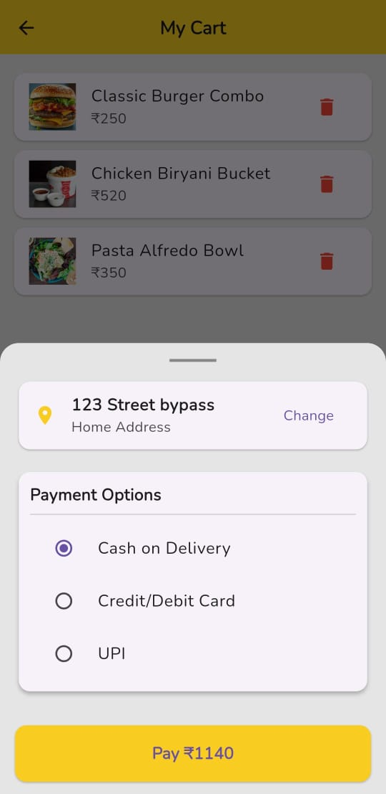
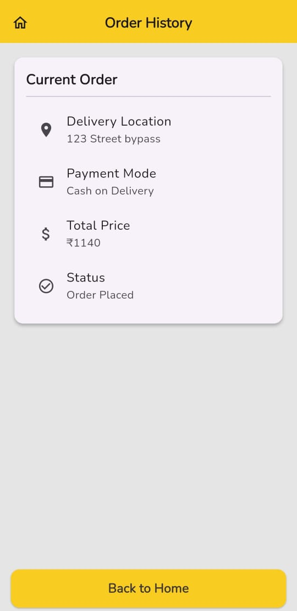

# 🍔 Food Ordering App  

A Flutter-based food ordering app built as part of my **Internship Assignment**.  
It allows users to browse hotels, view menus, add items to cart, and place orders with a clean UI and smooth navigation.  

---

## 🚀 Features  

- 🏨 Hotel listing with details (image, location, rating)  
- 🍕 Food menu with prices, discounts & delivery time  
- 🛒 Cart management (Add/Remove items) using **Bloc**  
- 💳 Checkout flow with payment button  
- 📱 Responsive UI & smooth scrolling  
- 🧭 Navigation using **GetX** (getPages + arguments)  

---

## 🛠️ Tech Stack  

- **Flutter** (3.x)  
- **Dart**  
- **GetX** for navigation  
- **Bloc** for state management  
- **Material UI**  

---

## 📂 Project Structure  

lib/
├── bloc/ # Bloc files for cart
├── mockData/ # Dummy hotel/food data
├── pages/ # Screens (home, detail, checkout, etc.)
├── utils/ # Colors, constants
└── main.dart # Entry point

yaml
Copy code

---

## ▶️ Run Locally  

1. Clone the repo  
   ```bash
   git clone https://github.com/yourusername/food-order-app.git
   cd food-order-app
Install dependencies

bash
Copy code
flutter pub get
Run the app

bash
Copy code
flutter run
📸 Screenshots

| Home | Hotel Detail | Cart | Checkout | Orders |
|------|--------------|------|----------|--------|
|  |  |  |  |  |

